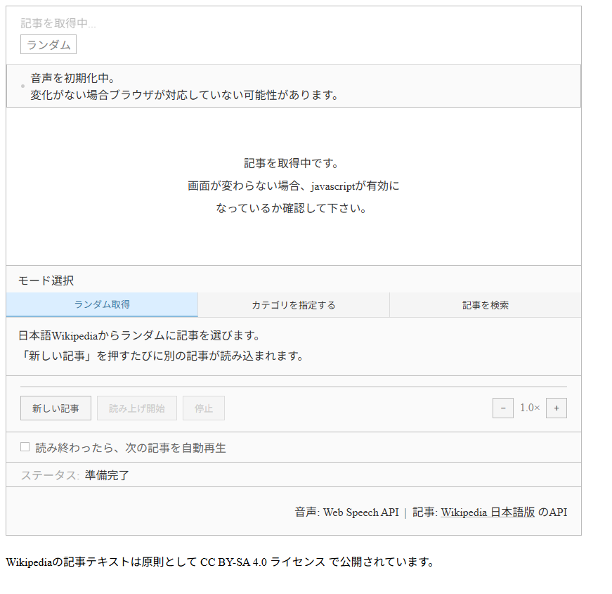

# Wiki-WebSpeechReader

日本語Wikipediaの記事をブラウザの音声合成（Web Speech API）で読み上げるウィジェットです。 
既存サイトのbody内に3ファイルを組み込むだけで動作します。

[動作例はこちら](https://abatbeliever.net/software/web/WikipediaReader/)  
[アプリ版(Tauri)はこちら](https://github.com/ABATBeliever/Wiki-WebSpeechReader-bin/)

---

## ファイル構成

| ファイル | 役割 |
|---|---|
| `index.html` | 開くファイル |
| `wikireader.css` | スタイル指定 |
| `wikireader.js` | ロジック |

---

## 利用方法方法

最低限のHTMLで構成されています。 
各自のサイトに埋め込むことで、CSSを引き継ぎつつ利用できます。

または、そのままファイルを開いてください。

---

## 機能

### 再生モード

| モード | 動作 |
|---|---|
| ランダム取得 | Wikipedia日本語版からランダムに記事を取得 |
| カテゴリを指定 | カテゴリ名を入力し、そのカテゴリ内の記事をランダムに取得 |
| 記事を検索 | 記事名を直接検索 |

### 読み上げ制御

- ▶ 読み上げ開始 / ⏸ 一時停止
- ⏹ 停止
- 速度調整
- 段落クリック
- 自動再生チェックボックス
  - 読み終わると次の記事を自動で読み込み・再生（検索モードでは無効）

### 読み上げの仕様

- 冒頭に「『(記事名)』について。」と付け足す
- 段落ごとに異なる日本語音声を使用
- 引用・コードブロックと判定された段落はスピードを落とす
- 現在読んでいる段落をハイライト表示

---

## 技術仕様

| 項目 | 内容 |
|---|---|
| 音声合成 | Web Speech API |
| 記事取得 | Wikipedia MediaWiki API |
| JS名前空間 | `window.WR` |

※ Wikipedia MediaWiki API を利用しているため、リロードを繰り返したりしないでください。

---

## 動作環境

Web Speech APIに対応したブラウザが必要です。

---

## ライセンス

記事コンテンツはWikipedia（CC BY-SA 4.0）に帰属します。
